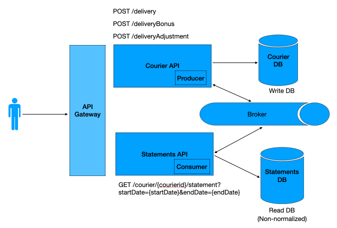

# CHALLENGE SKIP V1

##
This project contains the initial version for handling delivery events using an architecture based in the CQRS Pattern. 

     There are two components in this repository:
        - A service implementing a REST API to query the statements for courier
        - A Consumer which listen to Delivery-type events and keep the read-only database sync with the write-db.  

### Pre-requisites:
- Docker installed and logged to allow download images

###  How to execute the application:
 - Start the CourierservApplication.java using your preferred IDE
 - The application will run its dependencies in containers (Postgres, RabbitMQ)


###  How to post an event:
~~Use the api to post a delivery or patch with an change~~(To-be)

(As-is - while in development)
- Access http://localhost:15672/
- Go to the Queues tab
- Locate the queue named "delivery_queue" and post a message
  - Example message (Sync Delivery Created):
      ```
        {
            "eventId":"abc",
            "deliveryId":"abc",
            "value":10.5,
            "eventType":"CREATE_DELIVERY",
            "eventTimestamp":"2023-12-29T21:40:20.000",
            "courierId":8
        }
    ```
  - Example message (Sync Delivery Adjustment):
    ```
    {
      "eventId":"abc",
      "deliveryId":"02b421c4-18df-4036-9984-5a916b768e13",
      "value":-1.5,
      "eventType":"ADJUST_DELIVERY",
      "eventTimestamp":"2023-12-29T21:40:20.000",
      "courierId":8
      }
      ``` 
      - Example message (Sync Delivery Bonus):
    ```
    {
      "eventId":"abc",
      "deliveryId":"02b421c4-18df-4036-9984-5a916b768e13",
      "value":1.5,
      "eventType":"ADD_BONUS_DELIVERY",
      "eventTimestamp":"2023-12-29T21:40:20.000",
      "courierId":8
      }
      ``` 

      


### How to query for a courier statement:
 - The application exposes a swagger UI to ease the use of the REST API. 
 - Access: http://localhost:8081/v1/swagger-ui/index.html

 - or, use the URL like the example -> http://localhost:8081/v1/delivery/courier/8/statement?startDate=2023-12-20&endDate=2023-12-30
 - or, using curl (can be used also in tools like Postman or Insomnia):
    ```shell
   curl -X 'GET' 'http://localhost:8081/v1/delivery/courier/8/statement?startDate=2023-12-20&endDate=2023-12-30' 
   ```
